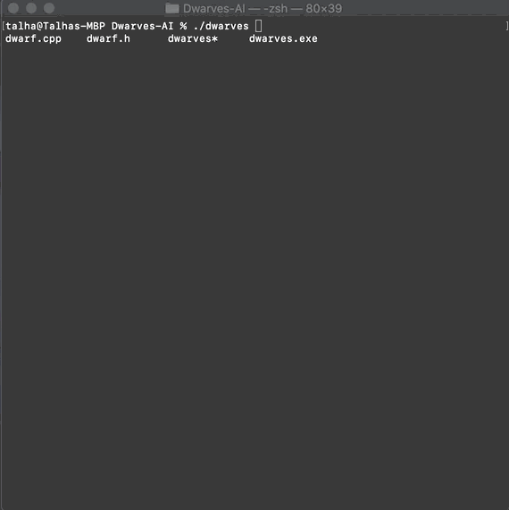

# Dwarves-AI
 Console-based game where dwarves gather resources

 Utilizes a BFS pathfinding algorithm to find the closest resources to gather.

  

# Requirements
 - *Unix-based terminal

# Instructions
  1. Clone or download the repository 
  2. Launch your preferred unix terminal in the folder. Resize window dimensions to ~80x40
  3. Type command "./dwarves" to run with 1 dwarf or "./dwarves b" to run with several dwarves.
